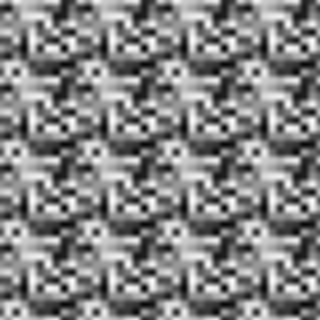

# atlas-scalar-noise

An implementation of 2D value noise, used to generate smooth grids of noise.

[](https://travis-ci.org/atlassubbed/atlas-scalar-noise)

---

## install 

```
npm install --save atlas-scalar-noise
```

## why

I was introduced to Perlin noise, which I thought was pretty neat. I wanted to try and implement it myself, but instead ended up implementing value noise, which is much simpler and tends to look more digital than Perlin noise.

When generating random numbers (noise), we will often want to interpolate between them to make the noise appear blurry and smooth (like a gas cloud). On a large scale, the generated noise should appear random, however on a small scale, adjacent values should be very close to each other.

Value noise is pretty simple to understand:
  
  1. Generate a rectangular grid of random numbers between 0 and 1.
  2. Interpolate between the lattice points so that transitions between their values are smooth.

For example, if I generate two adjacent random numbers `[.51, .42]`, plotting them next to each other will result in a discontinuous-looking step (`delta = .09`). I might want to smooth the transition with 2 intermediate values: `[.51, .48, .45, .42]`. In this interpolation, our `delta = .03`, which is smaller, making the values appear closer together. We can generalize this simple, one-dimensional example to `N` dimensions, but for now we'll stick with two dimensions.

## examples

### generating a grid

Value noise requires a random grid to work. The grid defines random values at various points on your image. All of the values in between are implied with linear interpolation and cubic smoothing. Smoothing helps remove linear artifacts in the output image.

#### rectangular grid

We can generate pseudorandom rectangular grids:

```javascript
const ScalarNoiseGenerator = require("atlas-scalar-noise");
// generates a 100x200 grid
const rectGrid = new ScalarNoiseGenerator(100, 200);
```

#### square grid

We can also generate square grids:

```javascript
...
// generates a 100x100 grid
const squareGrid = new ScalarNoiseGenerator(100) 
```

### generating noise

Once we've generated our grid, we can use that grid to generate noise. The grid defines an `NxM` lattice of pseudorandom points. We can get pixels at the grid lattice points, and/or between them if we want. For the rest of these examples, let's assume we have a `Canvas` API which lets us generate an empty canvas, set pixels on it and print the resultant image. We'll use the square grid we created in the example above for simplicity, but feel free to play around with rectangular grids, too.

#### regular noise

We don't *have* to interpolate our lattice if we don't want to. For example, if we only get pixels at exactly the grid lattice points, we will end up with regular noise, with the output image being identical to the grid:

```javascript
...
const Canvas = require("./Canvas");
const squareCanvas = new Canvas(100, 100)

for (let x = 100; x--;){
  for (let y = 100; y--;){
    // multiply noise value 255 to set greyscale val between 0 and 255
    squareCanvas.setPixel(255 * squareGrid.getPixel(x, y))
  }
}
squareCanvas.print()
```

<p align="center">
  
</p>

Keep in mind, this image was originally 100x100. I've blown up the image by a factor of 4 so you can see the individual pixels more easily. As you can see, all of the adjacent pixels are random and uninterpolated, just like regular noise. That's because we only called `squareGrid.getPixel` at the *exact* grid lattice points. We didn't *tell* our value noise generator to get pixels in between the lattice points!

#### value noise

Okay, so we've seen how we can generate boring noise from only the grid lattice points. But we want value noise! We can use the grid to generate pixels in between the lattice points, giving us proper value noise. In order to get pixels in between the lattice points, we need to increment our `x` and `y` values by amounts less than one. We can divide our `x` and `y` values by a scale factor. A scale factor of `4` tells the generator that we are interested in interpolating 3 brand new values in between every grid point. The `x` values will be: `[0, .25, .5, .75, 1, ..., 99, 99.25, 99.5, 99.75]` for a total of 400 values. This is also true for the `y` values, since our grid is a square.

```javascript
...
const size = 400;
const scaleFactor = 4;
const squareCanvas = new Canvas(size, size);
for (let x = size; x--;){
  for (let y = size; y--;){
    squareCanvas.setPixel(
      255 * squareGrid.getPixel(x/scaleFactor,y/scaleFactor)
    )
  }
}
squareCanvas.print()
```

<p align="center">
  
</p>

As you can see, the noise looks "smoother" than in the previous example. This is because we are interpolating and smoothing values between the grid lattice points. Wait, this still looks pretty noisy and ugly as hell -- we want better looking value noise.

#### better value noise

The reason why the example above still looks pretty rough is that we aren't interpolating enough values in between our grid points. The more we interpolate, the smoother the output image will look. In this example, we will use a smaller grid and interpolate more values in between the lattice points, while keeping our canvas a square of size `400`.

```javascript
...
const smallSquareGrid = new ScalarNoiseGenerator(10)
const size = 400;
const scaleFactor = 40;
const squareCanvas = new Canvas(size, size);
for (let x = size; x--;){
  for (let y = size; y--;){
    squareCanvas.setPixel(
      255 * smallSquareGrid.getPixel(x/scaleFactor,y/scaleFactor)
    )
  }
}
squareCanvas.print()
```

<p align="center">
  
</p>

That looks more like it! Since our scale factor is *larger* and we *divide* our `x` and `y` values by it, more points will be generated in between each grid point. Namely, there will be 39 interpolation points between every grid lattice point, as opposed to only 3 in the previous example. For example, our new `x` values are: `[0, .025, .05, ..., 9.925, 9.95, 9.975]` for a grand total of 400 values. This is also true for the `y` values, since our grid is a square. 

As you can see, our features are much larger and it looks much smoother. I've always thought that value noise had a blocky, digital feeling to it -- kind of like a blurry sattelite photo of buildings and parking lots.

#### infinite value noise

You might we wondering what happens if we try to generate noise for `x` and `y` values which are not inside of our grid. For example, if we have a grid of size `10x10`, what happens if we try `grid.getPixel(11,11)`? This is outside of our grid, so will it work? Let's try it using our small square grid:

```javascript
...
const size = 400;
const scaleFactor = 10;
const squareCanvas = new Canvas(size, size);
for (let x = size; x--;){
  for (let y = size; y--;){
    squareCanvas.setPixel(
      255 * smallSquareGrid.getPixel(x/scaleFactor,y/scaleFactor)
    )
  }
}
squareCanvas.print()
```

<p align="center">
  
</p>

Notice how the noise seems to repeat itself. This is because `ScalarNoiseGenerator` implements periodic boundary conditions -- if you try and reach for a pixel that isn't inside the grid's boundary, it will "wrap around" and get the value from the beginning of the grid. To answer the question above, if we have a grid size of `10x10` and try `grid.getPixel(11,11)`, we would really just be getting the value of `grid.getPixel(1,1)`.

To understand why this example tesselated, we need to look at our scale factor. It was reduced from `40` to `10` *without* changing our canvas size, meaning the `x` values become: `[0, .1, .2, ..., 39.7, 39.8, 39.9]` for a total of 400 points. This is also true for the `y` values, since our grid is a square. Notice how we almost go up to `40` in both dimensions -- meaning we are "wrapping" around our `10x10` grid three extra times.

This tesselation is useful when you want to try and create repeating patterns from some base grid, or if you want to indefinitely continue noise in some direction.

#### fractal value noise

Now that we understand how to generate value noise, let's create a gas cloud. First, let's understand what a frequency spectrum is. You can represent a continuous function (like an image) as a sum of various frequencies -- when you generate value noise with lots of interpolation points (like in our third example), you'll end up with larger features, signifying *lower* frequencies. If you use fewer interpolation points (like in our first couple of examples), you'll end up with very fine-grained features, signifying *higher* frequencies.

Fractal noise is where you reduce contributions from higher frequency signals according to a power law, as opposed to white noise which has a uniform contribution from all frequencies. In this example, we'll use the same grid to generate the final image fractal, but you could also use different grids to avoid potential artifacts:

```javascript
...
const size = 400;
// scale factors should add up to 400 
// so we're not getting an artifically dark image
const scaleFactors = [200, 100, 50, 20, 12, 8, 6, 4];
const squareCanvas = new Canvas(size, size);

for (let x = size; x--;){
  for (let y = size; y--;){
    const noiseValue = scaleFactors.reduce((p, factor) => {
      const frequency = size/factor;
      return p + smallSquareGrid.getPixel(x/factor, y/factor)/frequency
    }, 0)
    squareCanvas.setPixel(255 * noiseValue)
  }
}
squareCanvas.print()
```

<p align="center">
  
</p>

This is what pink noise looks like -- it reminds me of the gas in The Elder Scrolls V: Skyrim's main start menu screen. You might notice some strange radial artifacts towards the center. This may be due to using the same grid for each frequency component. You may get unwanted constructive and destructive interference or other linear repetitions as in this example:

<p align="center">
  
</p>

#### fractal value noise with unique grids

Let's copy the example above, but instead use a different random grid for each of our frequency components:

```javascript
...
const makeGrid = () => new ScalarNoiseGenerator(10)
const size = 400;
const scaleFactors = [200, 100, 50, 20, 12, 8, 6, 4];
const grids = Array(scaleFactors.length).fill().map(makeGrid)
const squareCanvas = new Canvas(size, size);

for (let x = size; x--;){
  for (let y = size; y--;){
    const noiseValue = scaleFactors.reduce((p, factor, i) => {
      const frequency = size/factor;
      const smallSquareGrid = grids[i];
      return p + smallSquareGrid.getPixel(x/factor, y/factor)/frequency
    }, 0)
    squareCanvas.setPixel(255 * noiseValue)
  }
}
squareCanvas.print()
```

<p align="center">
  
</p>

Overall, there seem to be fewer artifacts when using unique grids for each frequency component.

#### scanning tunnelling microscopy

In our final example, we'll use value noise to generate a picture which looks a lot like a picture of an atomic lattice:

```javascript
...
const size = 400;
const quantumNoise = new ScalarNoiseGenerator(size)
const atomicLattice = new ScalarNoiseGenerator(2)
const squareCanvas = new Canvas(size, size);
const scaleFactor = 10;

for (let x = size; x--;){
  for (let y = size; y--;){
    const noiseValue = .1 * quantumNoise.getPixel(x,y) +
      .9 * atomicLattice.getPixel(x/scaleFactor, y/scaleFactor)
    squareCanvas.setPixel(255 * noiseValue)
  }
}
squareCanvas.print()
```

<p align="center">
  
</p>

By now, hopefully it's clear how easy useful value noise can be for generating digital artwork and other graphics.

## caveats 

Not fully optimized! For educational purposes and fun.